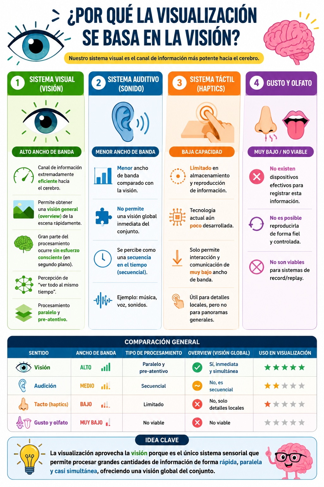

# Visualización de Datos
## ¿Qué es la visualización y por qué utilizarla?

---

## Definición de visualización

La visualización se define como:

{: .important }
> Sistemas computacionales que generan representaciones visuales de datos diseñadas para ayudar a las personas a realizar tareas de manera más efectiva. (Munzner, T.)

  

    🧠 Elementos clave
  

1. Personas y Datos
2. Representación visual
3. Realizar tareas

---

## El rol del ser humano (Human-in-the-loop)

Muchos problemas de análisis de datos mal especificados:
- No se conocen exactamente las preguntas desde el inicio 
- Existen múltiples posibles direcciones de análisis 
- Se requiere exploración y adaptación continua 

  

    <h4>❌ ¿Cuándo NO es necesaria la visualización?</h4>
    No se necesita visualización cuando existe una <b>solución completamente automática confiable</b>.
  

  

    <h4>✔️ ¿En qué casos SÍ es útil la visualización?</h4>
    - Análisis de datos contínuos, p.e.: EDAs científicos 
    - Comunicación de hallazgos, p.e.: <a href="https://www.nytimes.com/international/section/upshot">The New York Times – Upshot</a> 
    - Comprensión del problema y en la definición de los requerimientos. 
    - Refinamiento de los algoritmos, p.e.: ajuste parámetros y validación del comportamiento del modelo. 
    - Evaluación de los resultados, p.e.: detección errores y validación de sistemas automáticos.
  

{: .highlight }
> La visualización no reemplaza a los sistemas automáticos, sino que los complementa, especialmente cuando hay incertidumbre, exploración o necesidad de interpretación.

---

## Representaciones visual: Cognición vs Percepción

La visualización permite:

- Reducir carga cognitiva
- Transformar tareas *cognitivas* en **perceptuales**

  

    <h4>Leer tablas → requiere memoria</h4>
    <table style="width: 75%">
      <thead>
        <tr>
          <th>ID</th>
          <th>Valor A</th>
          <th>Valor B</th>
          <th>Valor C</th>
        </tr>
      </thead>
      <tbody>
        <tr><td>1</td><td>12</td><td>45</td><td>78</td></tr>
        <tr><td>2</td><td>15</td><td>50</td><td>82</td></tr>
        <tr><td>3</td><td>11</td><td>47</td><td>80</td></tr>
        <tr><td>4</td><td>18</td><td>52</td><td>85</td></tr>
        <tr><td>5</td><td>14</td><td>49</td><td>79</td></tr>
      </tbody>
    </table>
  

  

    <h4>Ver visualización → permite detectar patrones rápidamente</h4>
    <table style="width: 75%">
      <thead>
        <tr>
          <th>ID</th>
          <th>Valor A</th>
          <th>Valor B</th>
          <th>Valor C</th>
        </tr>
      </thead>
      <tbody>
        <tr><td>1</td><td>🟢</td><td>🟡</td><td>🔴</td></tr>
        <tr><td>2</td><td>🟢</td><td>🟡</td><td>🔴</td></tr>
        <tr><td>3</td><td>🟢</td><td>🟡</td><td>🔴</td></tr>
        <tr><td>4</td><td>🟢</td><td>🔴</td><td>🔴</td></tr>
        <tr><td>5</td><td>🟢</td><td>🟡</td><td>🔴</td></tr>
      </tbody>
    </table>
    <h5>Leyenda:</h5> 
    <ul>
      <li>🟢 Bajo</li>
      <li>🟡 Medio</li>
      <li>🔴 Alto</li>
    </ul>
  

{: .highlight }
> La visualización transforma tareas cognitivas (leer, recordar, comparar) en tareas perceptuales (ver, reconocer, identificar).

---

## ¿Por qué la visión?

  

    Infografía comparativa de sentidos
  

---

## Importancia de visualizar

### ✏️ Actividad: Interpretación

{: .highlight }
> La visualización de datos facilita un análisis más profundo al permitir observar detalles que suelen perderse en los resúmenes estadísticos, identificar anomalías o comportamientos atípicos de manera rápida y validar la coherencia de modelos mediante la inspección directa de la información.